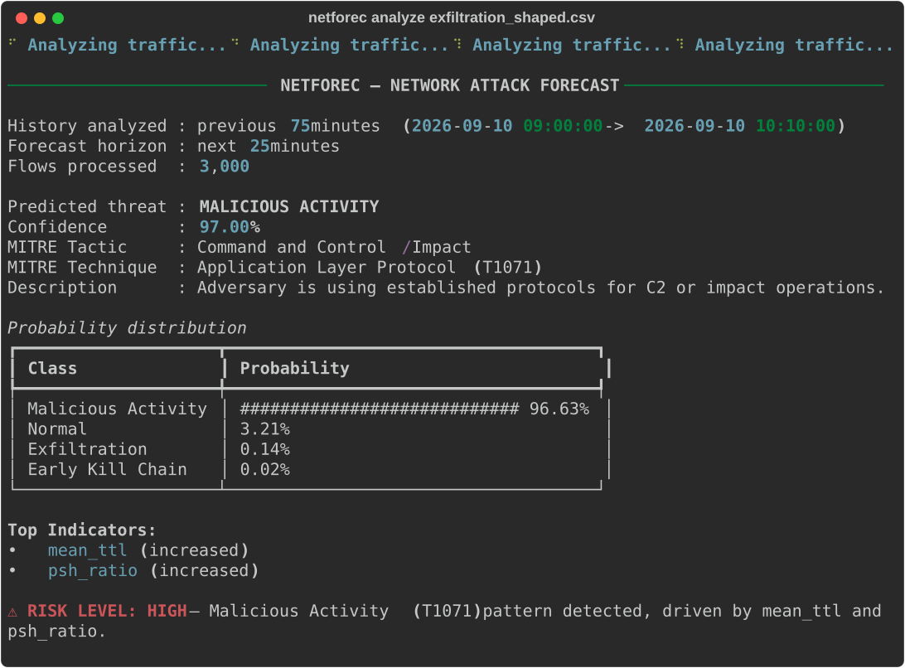
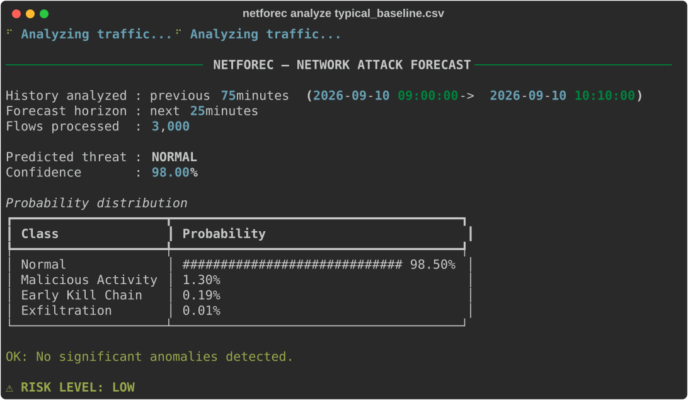
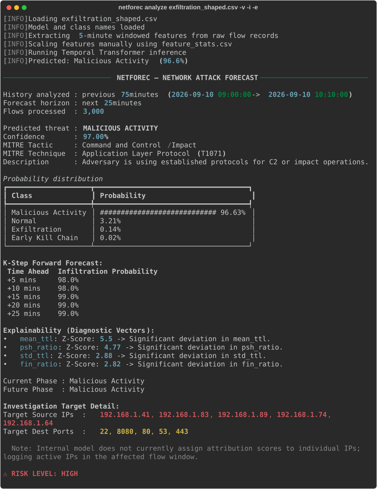
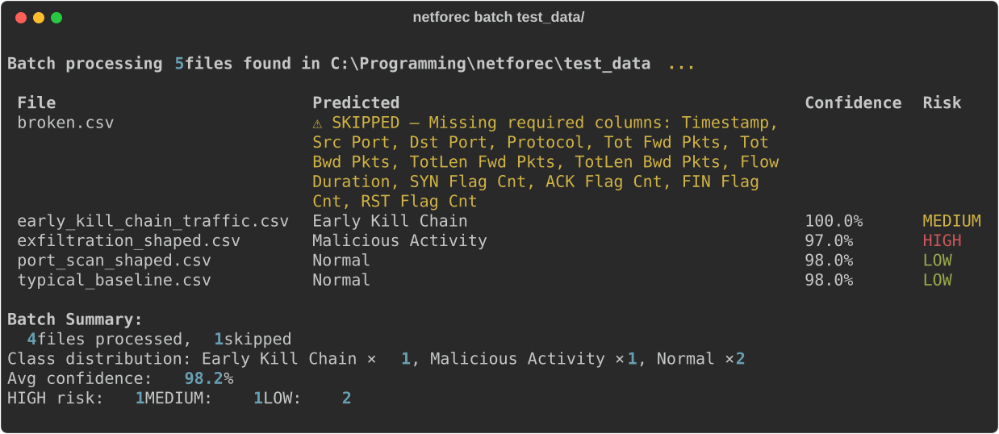
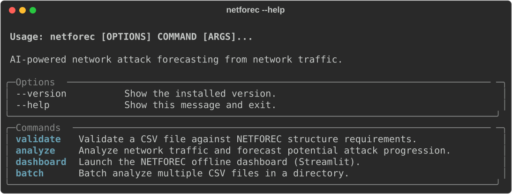
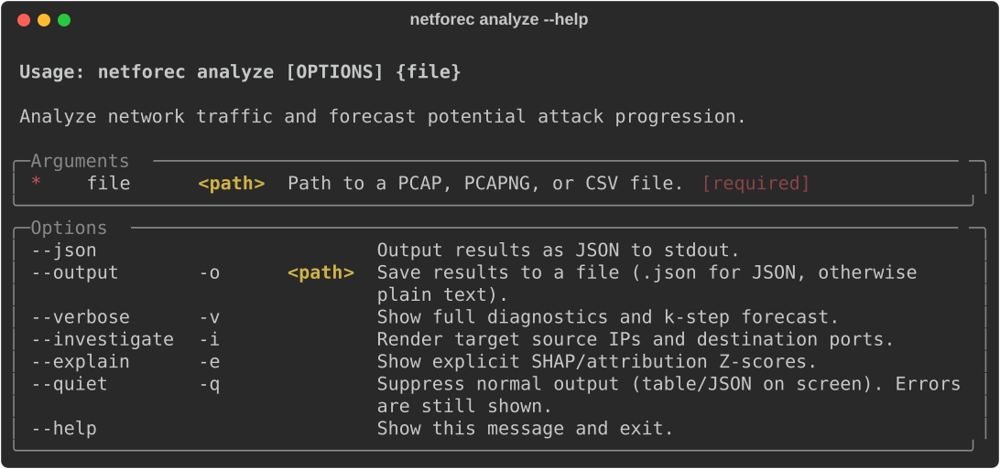
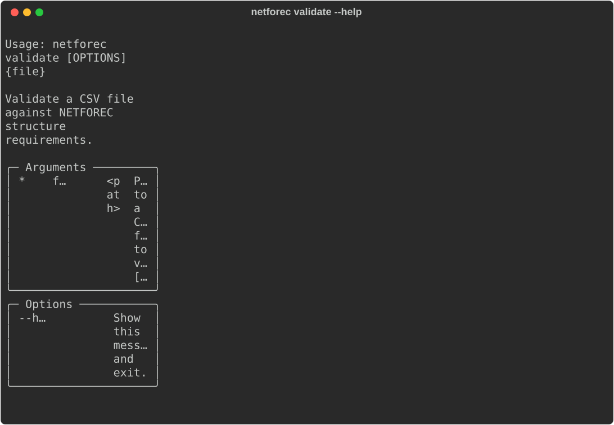
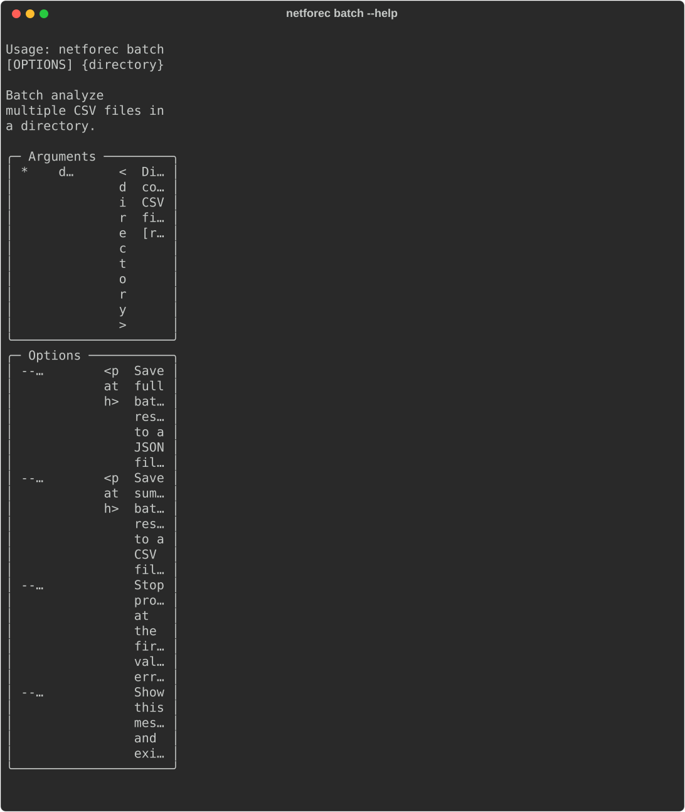
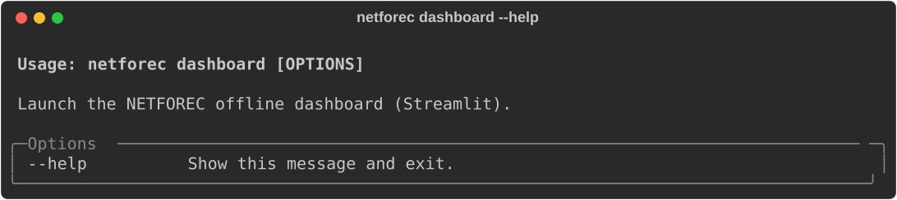

# NETFOREC — AI-Powered Network Attack Forecasting

> **SIH Problem Statement 26153** — National Technical Research Organisation (NTRO)  
> *Theme: Blockchain & Cybersecurity*

An AI-powered CLI tool that learns network traffic behaviour and forecasts potential cyberattacks **before** compromise is completed. NETFOREC ingests flow-level network traffic data, extracts temporal features, and uses a trained Temporal Transformer world model to predict the continuous trajectory and severity of malicious activity in the near future.

---

## Key Features

- **World Model Architecture** — Trained Temporal Transformer that learns network state-transition dynamics `P(S_t+1 | S_t)` from temporal traffic patterns instead of static classification.
- **Dynamic 4-Class Threat Prediction** — Forecasts exact MITRE-mapped attack phases aligning directly to Normal, Early Kill Chain, Malicious Activity, or Exfiltration behavior.
- **Advanced 30-Dim Feature Engineering** — Aggregates raw per-flow traffic into 5-minute network-state windows, extracting highly complex temporal signals (entropic deviations, TCP flag ratio mapping).
- **Risk Assessment** — Automatic risk-level classification (LOW / MEDIUM / HIGH) based on prediction confidence.
- **CLI-First Design** — Clean, scriptable interface with human-readable tables, JSON output, and file export.

---

## Architecture Overview

```
┌──────────────────────────────────────────────────────────────────────┐
│                        NETFOREC Pipeline                             │
│                                                                      │
│  ┌─────────┐    ┌─────────────┐    ┌──────────┐    ┌──────────────┐  │
│  │ Raw CSV │───►│  Extended   │───►│ CSV Mean │───►│   Temporal   │  │
│  │ Traffic │    │  Extraction │    │  Scaler  │    │ Transformer  │  │
│  │ (Flows) │    │ (15×30 seq) │    │  (.csv)  │    │    (.pt)     │  │
│  └─────────┘    └─────────────┘    └──────────┘    └──────┬───────┘  │
│                                                           │          │
│                                 ┌─────────────────────────┘          │
│                                 ▼                                    │
│                     ┌────────────────────────┐                       │
│                     │   4-Class Trajectory   │                       │
│                     │  + K-Step Forecasting  │──► Risk & MITRE DB    │
│                     │  + Deviation Evidence  │──► CLI / Dashboard    │
│                     └────────────────────────┘                       │
└──────────────────────────────────────────────────────────────────────┘
```

**Input:** 75 minutes of continuous flow-level traffic (15 targeted 5-minute windows).  
**Output:** Probability distribution across 4 progressive attack stages and K-step probability curves for the next 25-minute horizon.

---

## Setup Instructions

### Prerequisites

- Python 3.9 or higher
- pip (Python package manager)

### Installation

```bash
# 1. Clone the repository
git clone https://github.com/jagdish-15/netforec.git
cd netforec

# 2. Install the package and dependencies
pip install -e .
```

This installs the `netforec` command globally in your environment — no PATH configuration needed.

---

## Core Architecture & Usage

**NETFOREC is engineered natively as an automated Command-Line Integration (CLI) engine**, optimizing for raw speed, high-throughput pipeline batching, and strict offline enterprise deployments. While standard models rely on manual UI interventions, NETFOREC is designed to run silently inside Security Operations Center (SOC) pipelines, scraping machine-readable telemetry at scale.

**The Two Execution Layers:**
1. **The CLI Engine (Primary):** A programmatic, ultra-fast scriptable interface built for headless automation, multi-file batch reporting, and direct JSON telemetry streaming.
2. **The Dashboard (Secondary Visualizer):** A strictly local Streamlit diagnostic interface for human-in-the-loop executive presentation triage.

*IMPORTANT: Both layers execute **100% offline** on the bare-metal host machine. No external webhooks, cloud APIs, or hosted deployment environments (e.g. Streamlit Cloud) are invoked. Telemetry never leaves the host network, strictly adhering to air-gapped critical infrastructure constraints.*

### 1. The CLI Automation Engine

```bash
# Display core commands and schema arguments
netforec --help

# High-throughput batch processing and reporting for an entire directory of captures
netforec batch test_data/ --json --output incident_report.json

# Standard console analysis for a singular traffic instance
netforec analyze sample_traffic.csv

# Deep-dive forensic mode — active attribution tracing and Z-Score evidence extraction
netforec analyze sample_traffic.csv --investigate --explain

# Verbose mode — actively trace internal pipeline normalization transformations
netforec analyze sample_traffic.csv --verbose

# Headless Silent Execution (Perfect for automated scripting and UI decoupling)
netforec analyze sample_traffic.csv --json --output result.json --quiet
```

### 2. Secondary Presentation Dashboard

For visual executive reporting on singular security events, NETFOREC ships with an attached presentation layer.

```bash
# Spools the local Streamlit presentation web-server natively
netforec dashboard
```
*Note: If no file is manually uploaded, the dashboard will dynamically pre-load an internal synthetic pipeline example (`syn_flood_shaped.csv`) so you can immediately observe the live temporal trajectory engine in action.*

### Sample Output

#### Threat Detected

<p align="center">
  
</p>

#### Normal Traffic

<p align="center">
  
</p>

#### Full Forensic Output (`--verbose --investigate --explain`)

<p align="center">
  
</p>

#### Batch Processing

<p align="center">
  
</p>

---

## CLI Commands Reference

<p align="center">
  
</p>

<details>
<summary><code>netforec analyze --help</code></summary>
<br />
<p align="center">
  
</p>
</details>

<details>
<summary><code>netforec validate --help</code></summary>
<br />
<p align="center">
  
</p>
</details>

<details>
<summary><code>netforec batch --help</code></summary>
<br />
<p align="center">
  
</p>
</details>

<details>
<summary><code>netforec dashboard --help</code></summary>
<br />
<p align="center">
  
</p>
</details>


---

## Input Data Format

The input CSV must follow the **CIC-IDS2018** flow record format with these required columns:

| Column | Description |
|--------|-------------|
| `Timestamp` | Format: `DD/MM/YYYY HH:MM:SS` |
| `Tot Fwd Pkts` | Total forward packets |
| `Tot Bwd Pkts` | Total backward packets |
| `TotLen Fwd Pkts` | Total forward packet length |
| `TotLen Bwd Pkts` | Total backward packet length |
| `Flow Duration` | Duration of the flow |
| `Flow IAT Mean` | Mean inter-arrival time |
| `Pkt Len Mean` | Mean packet length |
| `Pkt Len Std` | Packet length standard deviation |
| `SYN Flag Cnt` | SYN flag count |
| `ACK Flag Cnt` | ACK flag count |
| `RST Flag Cnt` | RST flag count |
| `FIN Flag Cnt` | FIN flag count |
| `Down/Up Ratio` | Download/upload ratio |
| `Active Mean` | Mean active time |
| `Idle Mean` | Mean idle time |

The file must contain **at least 75 minutes** of continuous traffic (15 contiguous 5-minute windows) for the model to successfully bootstrap the structural transformer sequences.

---

## Project Structure

```
netforec/
├── pyproject.toml              # Package config, dependencies, CLI entry point
├── README.md                   # This file
├── docs/                       # CLI output screenshots (SVG)
├── test_data/                  # Sample traffic CSVs for smoke-testing
└── netforec/
    ├── __init__.py
    ├── cli.py                  # UI layer — Typer commands, formatting, I/O
    ├── pipeline.py             # Orchestrates: feature extraction → scaling → model
    ├── features.py             # Raw CSV → (15, 30) windowed feature sequence
    ├── model.py                # PyTorch Temporal Transformer architecture definition
    ├── validation.py           # Integrity enforcement routines
    ├── webapp.py               # Streamlit interactive frontend (dashboard)
    └── model_artifacts/
        ├── world_model.pt         # Trained Transformer weights (state_dict)
        ├── feature_stats.csv      # CSV-based hardware-agnostic scaler metrics
        ├── mitre_map.json         # Direct mapping of vectors to MITRE intel
        └── metadata.json          # Architecture and classification maps
```

---

## Technical Details

### Feature Engineering

Raw per-flow CSV records are aggregated into **5-minute network-state windows**, reliably yielding **30 dimensions of telemetry** per window:

- **Volume metrics:** Flow count, forward/backward packet and byte totals
- **Timing metrics:** Average flow duration, inter-arrival time
- **Packet characteristics:** Mean packet length, packet length standard deviation
- **TCP flag distributions:** SYN, ACK, RST, FIN flag counts
- **Flow behaviour:** Down/Up ratio, active/idle time averages

### Model Architecture

| Component | Specification |
|-----------|--------------|
| Architecture | Temporal Transformer with MLP Encoding |
| Input Structure | (15, 30) — 15 historical blocks × 30 dimensions |
| Latent Engine | 2-Layer Transformer Encoder with Self-Attention |
| Multi-Headed Output | 4 Class stages + K-Step probability trajectory curves |
| Forecast horizon | 25 minutes (sampled in 5-minute predictive intervals) |
| Diagnostic Attribution | Z-Score evidence extraction matching current active metrics |

### Prediction Classes (Kill-Chain Phases)

| Phase Mapping | Diagnostic Indication |
|-------|-------------|
| `Normal` | Baseline benign traffic flow. |
| `Early Kill Chain` | Initial phases of infiltration tracking reconnaissance. |
| `Malicious Activity` | Active internal disruption or internal vector exploitation. |
| `Exfiltration` | Final stage data-theft mapping to external destinations. |

---

## Tech Stack

| Component | Technology |
|-----------|-----------|
| Language | Python 3.9+ |
| CLI Framework | Typer + Rich |
| ML Framework | PyTorch |
| Data Processing | Pandas, NumPy |
| Model Serialization | joblib, scikit-learn |
| Dashboard | Streamlit, Altair |
| Dataset | CIC-IDS2018 |

---

## Team

**Team RuntimeErrors** — SIH 2026 Internal Hackathon

---

## License

This project is developed as part of the Smart India Hackathon 2026 (Problem Statement 26153).
